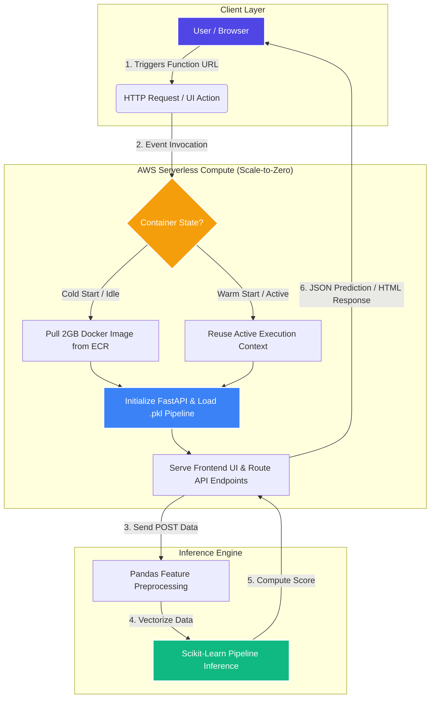

# 🧠 Mental Health Score Prediction App


[](https://www.python.org/)
[](https://fastapi.tiangolo.com/)
[](https://scikit-learn.org/)
[](https://www.docker.com/)
[](https://aws.amazon.com/lambda/)

A full-stack machine learning web application that predicts mental health scores based on user lifestyle data. Built with **FastAPI**, **Pandas**, and **Scikit-Learn**, and deployed serverlessly using **AWS Lambda** and **Amazon ECR**.


[🚀 Live Demo](#-live-demo) • [📐 Architecture](#-system-architecture) • [📦 Deployment Guide](#-deployment-guide)

---

## 🚀 Features
* **Machine Learning Backend:** Powered by a trained Scikit-Learn pipeline using demographic and behavioral metrics.
* **Interactive UI:** Clean, responsive web interface served directly via FastAPI static mounts.
* **Serverless Architecture:** Deployed on AWS Lambda for a cost-efficient, scale-to-zero setup ($0 when idle).

---

## 🛠️ Tech Stack
* **Python & FastAPI:** High-performance web framework and API routing.
* **Scikit-Learn & Pandas:** Data preprocessing and machine learning inference.
* **Docker & Amazon ECR:** Containerization and image registry.
* **AWS Lambda & Mangum:** Serverless execution environment.

---

## 📐 System Architecture




## 📁 Project Structure
```text
mental-health-app/
├── model/
│   └── mental_health_pipeline.pkl
├── static/
│   ├── index.html
│   ├── style.css
│   └── script_2.js
├── .dockerignore
├── Dockerfile
├── main.py
└── requirements.txt
```

---

## ⚙️ Prerequisites
Before running or deploying the app, ensure you have:
* [Docker Desktop](https://www.docker.com/) installed and running.
* [AWS CLI](https://aws.amazon.com/cli/) configured with your credentials (`aws configure`).

---

## 📦 Deployment Guide (AWS Lambda + ECR)

### 1. Build the Docker Image
To ensure compatibility with AWS Lambda, build the container image while explicitly disabling provenance metadata:
```bash
docker build --provenance=false -t mental-health-app .
```

### 2. Authenticate with AWS ECR
Log in to your AWS Elastic Container Registry (replace `<your-region>` and `<your-account-id>`):
```bash
aws ecr get-login-password --region <your-region> | docker login --username AWS --password-stdin <your-account-id>.dkr.ecr.<your-region>.amazonaws.com
```

### 3. Tag and Push the Image
Tag your local image and push it to your ECR repository:
```bash
docker tag mental-health-app:latest <your-account-id>.dkr.ecr.<your-region>[.amazonaws.com/mental-health-app:latest](https://.amazonaws.com/mental-health-app:latest)

docker push <your-account-id>.dkr.ecr.<your-region>[.amazonaws.com/mental-health-app:latest](https://.amazonaws.com/mental-health-app:latest)
```

### 4. Configure AWS Lambda
1. Open the **AWS Lambda Console** and click **Create function**.
2. Select **Container image**, name your function, and browse to select your ECR image.
3. Under **Advanced settings**:
   * Enable **Function URL**.
   * Set **Auth type** to **`NONE`**.
   * Check the **CORS** box.
4. Click **Create function**.

### 5. Update Resource Settings
Because machine learning libraries (`pandas` and `scikit-learn`) require sufficient memory to initialize:
1. Go to your Lambda function's **Configuration** tab.
2. Select **General configuration** -> **Edit**.
3. Set **Memory** to **1024 MB**.
4. Set **Timeout** to **30 seconds**.
5. Click **Save**.

🎉 **You're done!** Open your Lambda Function URL to view and test your application live.
