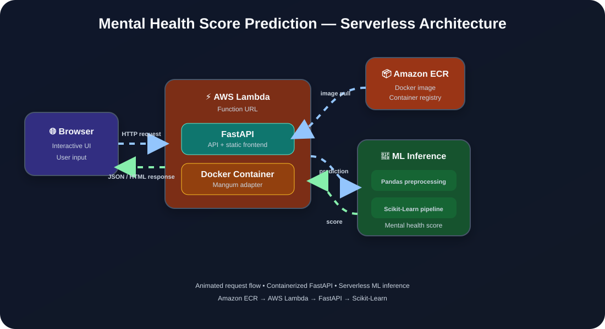

# 🧠 Mental Health Score Prediction App

<p align="center">
  
</p>

<p align="center">
  A serverless machine learning web application that predicts mental health scores from lifestyle and behavioral data.
</p>

<p align="center">

[](https://www.python.org/)
[](https://fastapi.tiangolo.com/)
[](https://scikit-learn.org/)
[](https://pandas.pydata.org/)
[](https://www.docker.com/)
[](https://aws.amazon.com/lambda/)
[](https://aws.amazon.com/ecr/)

</p>

<p align="center">
  <strong>FastAPI • Scikit-Learn • Docker • Amazon ECR • AWS Lambda • Serverless ML</strong>
</p>

---

## 🚀 Overview

**Mental Health Score Prediction App** is a full-stack machine learning web application that predicts a mental health score based on user lifestyle and behavioral data.

The application combines a **Scikit-Learn machine learning pipeline** with a **FastAPI backend** and an interactive web interface. The complete application is packaged into a Docker container and deployed using **Amazon ECR** and **AWS Lambda**.

The serverless deployment allows the application to run without maintaining a continuously running EC2 server.

> ⚠️ **Disclaimer:** This project is intended for educational and demonstration purposes only. It is **not a medical diagnostic tool** and should not be used as a substitute for professional medical or mental-health advice.

---

## ✨ Features

- 🧠 **Machine Learning Prediction** — Uses a trained Scikit-Learn pipeline to generate mental health score predictions.
- ⚡ **FastAPI Backend** — Handles HTTP requests, routing, and application logic.
- 📊 **Pandas Preprocessing** — Processes and prepares input data before model inference.
- 🌐 **Interactive Web Interface** — Simple frontend for entering data and viewing predictions.
- 🐳 **Dockerized Application** — Packages the application and ML dependencies into a portable container.
- ☁️ **AWS Lambda Deployment** — Runs the application using serverless compute.
- 📦 **Amazon ECR** — Stores the Docker container image used by Lambda.
- 🔄 **Scale-to-Zero Architecture** — No continuously running application server is required.
- 🚀 **Production-Style Deployment** — Demonstrates an end-to-end ML deployment workflow.

---

## 🧩 How It Works

The application follows this flow:

```text
User
  │
  │ Lifestyle / Behavioral Data
  ▼
Web Interface
  │
  │ HTTP Request
  ▼
AWS Lambda Function URL
  │
  │ Lambda Invocation
  ▼
Docker Container
  │
  ├── FastAPI
  │
  └── Mangum
       │
       ▼
Pandas Preprocessing
       │
       ▼
Scikit-Learn Pipeline
       │
       ▼
Mental Health Score
       │
       ▼
JSON / HTML Response
       │
       ▼
User
```

### 🔄 Prediction Flow

1. The user enters lifestyle and behavioral information through the web interface.
2. The browser sends the information to the application.
3. AWS Lambda receives the request through the Function URL.
4. The Lambda container initializes FastAPI when required.
5. FastAPI processes the request.
6. Pandas prepares the input data.
7. The trained Scikit-Learn pipeline performs inference.
8. The predicted mental health score is returned.
9. The frontend displays the result to the user.

---

## 📐 System Architecture

The application uses a **serverless container-based architecture**:

```text
                         ┌──────────────────────┐
                         │      Web Browser     │
                         │   HTML/CSS/JavaScript│
                         └──────────┬───────────┘
                                    │
                              HTTP Request
                                    │
                                    ▼
                         ┌──────────────────────┐
                         │ AWS Lambda Function  │
                         │        URL           │
                         └──────────┬───────────┘
                                    │
                                    ▼
                         ┌──────────────────────┐
                         │   Lambda Container   │
                         │                      │
                         │      FastAPI         │
                         │        +             │
                         │      Mangum          │
                         └──────────┬───────────┘
                                    │
                                    ▼
                         ┌──────────────────────┐
                         │ Pandas Preprocessing │
                         └──────────┬───────────┘
                                    │
                                    ▼
                         ┌──────────────────────┐
                         │ Scikit-Learn Pipeline│
                         └──────────┬───────────┘
                                    │
                                    ▼
                         ┌──────────────────────┐
                         │ Mental Health Score  │
                         └──────────┬───────────┘
                                    │
                                    ▼
                         ┌──────────────────────┐
                         │   Prediction Result  │
                         └──────────────────────┘
```

The repository also includes an animated SVG version of the architecture:

```text
assets/architecture.svg
```

---

## ☁️ AWS Deployment Architecture

The production deployment consists of the following AWS components:

### Amazon ECR

**Amazon Elastic Container Registry (ECR)** stores the Docker image containing:

- FastAPI application
- Python dependencies
- Pandas
- Scikit-Learn
- Trained ML pipeline
- Frontend application

### AWS Lambda

AWS Lambda executes the containerized application without requiring a continuously running server.

When a request arrives, Lambda creates or reuses an execution environment.

### Lambda Function URL

The Lambda Function URL provides an HTTP endpoint that allows the browser to communicate directly with the application.

### Mangum

**Mangum** acts as an adapter between the ASGI application and the AWS Lambda execution environment.

```text
HTTP Request
     │
     ▼
Lambda Function URL
     │
     ▼
AWS Lambda
     │
     ▼
Mangum
     │
     ▼
FastAPI
     │
     ▼
ML Pipeline
```

---

## ❄️ Cold Start vs Warm Start

One important characteristic of the serverless architecture is the difference between **cold starts** and **warm starts**.

### Cold Start

When Lambda needs a new execution environment:

```text
Request
   ↓
Initialize Container
   ↓
Start FastAPI
   ↓
Load ML Pipeline
   ↓
Process Request
   ↓
Return Prediction
```

The first request may therefore take longer because the application and ML dependencies need to initialize.

### Warm Start

When Lambda can reuse an existing execution environment:

```text
Request
   ↓
Existing Lambda Environment
   ↓
FastAPI Already Initialized
   ↓
ML Pipeline Already Loaded
   ↓
Prediction
   ↓
Response
```

This can reduce initialization overhead for subsequent requests.

---

## 🛠️ Tech Stack

| Layer | Technology | Purpose |
|---|---|---|
| Programming Language | Python 3.10+ | Application and ML development |
| Backend | FastAPI | API routing and application server |
| Data Processing | Pandas | Input data preprocessing |
| Machine Learning | Scikit-Learn | Model inference |
| Serverless Adapter | Mangum | FastAPI/Lambda integration |
| Frontend | HTML / CSS / JavaScript | User interface |
| Containerization | Docker | Package application and dependencies |
| Container Registry | Amazon ECR | Store Docker image |
| Cloud Compute | AWS Lambda | Serverless execution |
| API Endpoint | Lambda Function URL | HTTP access to application |

---

## 📁 Project Structure

```text
mental-health-app/
│
├── assets/
│   └── architecture.svg
│
├── model/
│   └── mental_health_pipeline.pkl
│
├── static/
│   ├── index.html
│   ├── style.css
│   └── script_2.js
│
├── .dockerignore
├── Dockerfile
├── main.py
├── requirements.txt
└── README.md
```

---

## ⚙️ Prerequisites

Before running or deploying the application, make sure you have:

- [Python](https://www.python.org/) 3.10+
- [Docker Desktop](https://www.docker.com/)
- [AWS CLI](https://aws.amazon.com/cli/)
- An AWS account with permissions to use Amazon ECR and AWS Lambda

### Configure AWS CLI

```bash
aws configure
```

Verify your AWS credentials:

```bash
aws sts get-caller-identity
```

---

# 🚀 Run Locally

### 1. Clone the Repository

```bash
git clone <your-repository-url>
```

Move into the project directory:

```bash
cd mental-health-app
```

### 2. Build the Docker Image

```bash
docker build --provenance=false -t mental-health-app .
```

### 3. Run the Container

```bash
docker run -p 8000:8000 mental-health-app
```

Open the application:

```text
http://localhost:8000
```

> If your Dockerfile uses a different application port, update the port mapping accordingly.

---

# 📦 AWS Deployment Guide

## 1. Build the Docker Image

Build the image:

```bash
docker build --provenance=false -t mental-health-app .
```

The `--provenance=false` option can help avoid container image compatibility issues when building images intended for AWS Lambda.

---

## 2. Create an Amazon ECR Repository

If you haven't already created the repository:

```bash
aws ecr create-repository \
  --repository-name mental-health-app \
  --region <your-region>
```

For example:

```text
ap-south-1
```

---

## 3. Authenticate Docker with Amazon ECR

Run:

```bash
aws ecr get-login-password --region <your-region> | docker login --username AWS --password-stdin <your-account-id>.dkr.ecr.<your-region>.amazonaws.com
```

---

## 4. Tag the Docker Image

```bash
docker tag mental-health-app:latest <your-account-id>.dkr.ecr.<your-region>.amazonaws.com/mental-health-app:latest
```

---

## 5. Push the Image to Amazon ECR

```bash
docker push <your-account-id>.dkr.ecr.<your-region>.amazonaws.com/mental-health-app:latest
```

After the push completes, the Docker image will be available in your ECR repository.

---

# ⚡ AWS Lambda Configuration

## 6. Create the Lambda Function

1. Open the **AWS Lambda Console**.
2. Select **Create function**.
3. Choose **Container image**.
4. Enter your Lambda function name.
5. Select the Docker image from Amazon ECR.
6. Create the function.

---

## 7. Configure the Lambda Function URL

Inside the Lambda function:

1. Open **Configuration**.
2. Select **Function URL**.
3. Create a Function URL.
4. Set the authentication type to `NONE` if you intentionally want the application to be publicly accessible.
5. Configure CORS as required.
6. Save the configuration.

> ⚠️ **Security:** A public Lambda Function URL allows anyone with the URL to access the application. Do not expose sensitive information or credentials through the application.

---

## 8. Configure Lambda Resources

ML libraries such as Pandas and Scikit-Learn require sufficient memory during initialization.

A suitable starting configuration is:

| Lambda Setting | Value |
|---|---:|
| Memory | 1024 MB |
| Timeout | 30 seconds |

These values can be adjusted after monitoring actual execution time and memory usage.

---

# 🧠 Machine Learning Pipeline

The application uses a serialized Scikit-Learn pipeline:

```text
User Input
    │
    ▼
Input Data
    │
    ▼
Pandas
    │
    ▼
Preprocessing
    │
    ▼
Scikit-Learn Pipeline
    │
    ▼
Prediction
    │
    ▼
Mental Health Score
```

The trained pipeline is stored at:

```text
model/mental_health_pipeline.pkl
```

Using a serialized pipeline keeps preprocessing and model inference together, helping ensure that prediction-time transformations remain consistent with the trained pipeline.

---

# 🔬 Model Inference

The application performs machine learning inference when a user submits prediction data.

```text
                    ┌────────────────────┐
                    │    User Input      │
                    └─────────┬──────────┘
                              │
                              ▼
                    ┌────────────────────┐
                    │ Data Preprocessing  │
                    │       Pandas        │
                    └─────────┬──────────┘
                              │
                              ▼
                    ┌────────────────────┐
                    │ Scikit-Learn       │
                    │ Pipeline           │
                    └─────────┬──────────┘
                              │
                              ▼
                    ┌────────────────────┐
                    │ Prediction         │
                    │ Mental Health Score│
                    └────────────────────┘
```

---

# 📊 Application Flow

```text
Browser
   │
   │ Prediction Request
   ▼
FastAPI
   │
   │ Process Request
   ▼
Pandas
   │
   │ Prepare Features
   ▼
Scikit-Learn Pipeline
   │
   │ Predict
   ▼
FastAPI
   │
   │ Return Result
   ▼
Browser
```

---

# 🔐 Security Considerations

For a production deployment, consider:

- Never commit AWS credentials or secrets.
- Use environment variables or AWS IAM for sensitive configuration.
- Avoid storing personally identifiable information unnecessarily.
- Add authentication if the application should not be public.
- Validate all user input.
- Add rate limiting if the endpoint is publicly accessible.
- Monitor Lambda logs and errors.
- Keep Python and dependency versions updated.
- Do not treat predictions as medical diagnoses.

---

# 📈 Future Improvements

- [ ] Add automated unit and integration tests.
- [ ] Add model evaluation metrics to the README.
- [ ] Add automated CI/CD deployment.
- [ ] Add authentication and authorization.
- [ ] Add API rate limiting.
- [ ] Add structured application logging.
- [ ] Add monitoring and alerting.
- [ ] Add model versioning.
- [ ] Optimize Lambda cold-start performance.
- [ ] Reduce Docker image size.
- [ ] Add automated model retraining.
- [ ] Add an API health-check endpoint.
- [ ] Add stronger input validation and error handling.

---

# 🎯 Project Objective

The primary objective of this project is to demonstrate an **end-to-end machine learning deployment workflow**:

```text
Data
 │
 ▼
Machine Learning Pipeline
 │
 ▼
FastAPI
 │
 ▼
Docker
 │
 ▼
Amazon ECR
 │
 ▼
AWS Lambda
 │
 ▼
Serverless Web Application
```

This project combines:

**Machine Learning + Python + API Development + Docker + AWS + Serverless Deployment**

into a single deployable application.

---

## ⚠️ Disclaimer

This application is a **machine learning demonstration project**.

The predicted mental health score should **not** be interpreted as a medical diagnosis, psychological assessment, or professional medical advice.

If someone is experiencing mental-health concerns, they should seek guidance from a qualified healthcare professional.

---

## 📄 License

If this repository is intended to be open source, add your preferred license here, such as the MIT License.

---

<p align="center">
  Built with 🐍 Python, ⚡ FastAPI, 🧠 Scikit-Learn, 🐳 Docker & ☁️ AWS Lambda
</p>